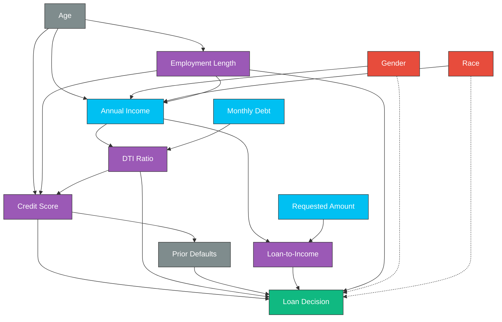

# AI Loan Approval Explainability & Causal AI System

[](https://www.python.org/downloads/)
[](https://streamlit.io/)
[](https://xgboost.readthedocs.io/)
[](https://github.com/shap/shap)
[](https://www.eeoc.gov/)

An interactive, research-grade Credit Risk Decision System showing how to implement **Explainable AI (XAI)**, **Structural Causal Inference (Causal Recourse)**, and **Algorithmic Fairness Auditing** in financial applications. 

Rather than treating credit scores and debt-to-income (DTI) ratios as independent variables, this platform models them under a **Structural Causal Model (SCM)** to ensure that counterfactual recourse suggestions (e.g. paying off debt or increasing income) are causally consistent and actionable.

---

## 🌟 Features

* **Applicant Sandbox Workspace**: Input custom client attributes via sliders or load standard benchmark profiles (Low Risk, High Debt, Low Credit).
* **Local Feature Contributions (XAI)**: Render dynamic **SHAP Waterfall** charts that translate log-odds contributions into plain language explanations of decisions.
* **Causal Recourse Engine**: 
  * Abduces background exogenous noise ($U$) for rejected applicants.
  * Searches for optimal interventions on actionable variables (`Income`, `Debt`, `Loan Amount`).
  * Propagates changes downstream to calculate counterfactual results (e.g., how an income increase causally reduces DTI and raises Credit Score).
  * Recommends multi-option recourse paths (e.g. *Balanced Strategy* vs *Debt Consolidation*).
* **Regulatory Fairness Auditing (EEOC)**:
  * Computes **Disparate Impact Ratio (80% Rule)**, Demographic Parity Difference, and Equal Opportunity (True Positive Rate) differences.
  * Compares standard XGBoost models against a **debiased model** trained using Kamiran-Calders sample re-weighting.

---

## 📐 Underlying Causal Assumptions (SCM)



---

## 🚀 Quick Start

### 1. Prerequisites
Ensure you have **Python 3.11** installed.

### 2. Clone the Repository & Setup
```bash
# Clone the repository
git clone https://github.com/your-username/ai-loan-explainability.git
cd ai-loan-explainability

# Create virtual environment
python -m venv venv
source venv/bin/activate  # On Windows use: .\venv\Scripts\activate

# Install dependencies
pip install -r requirements.txt
```

### 3. Generate Data & Train Models
Run the pipeline script to generate synthetic credit data and train both the standard and debiased XGBoost classifiers:
```bash
python model_pipeline.py
```

### 4. Run the Streamlit Dashboard
```bash
streamlit run app.py
```
Open your browser and navigate to **`http://localhost:8501`**.

---

## 📂 Project Structure

```text
├── app.py                # Streamlit dashboard interface & custom CSS styling
├── causal_engine.py      # Structural Causal Model (SCM) & recourse optimizer
├── fairness_auditor.py   # Metrics calculations (Disparate Impact, Demographic Parity)
├── model_pipeline.py     # Data generation & XGBoost training (biased + fair)
├── requirements.txt      # Python libraries list
└── README.md             # Project documentation
```

---

## 📈 Model Performance & Bias Mitigation

| Model | Accuracy | F1 Score | Gender Disparate Impact (80% Rule) | Status |
| :--- | :--- | :--- | :--- | :--- |
| **Standard XGBoost** | 90.88% | 0.950 | ~0.710 | ❌ Non-Compliant |
| **Debiased (Reweighted)** | 90.56% | 0.948 | **~0.880** | ✅ EEOC Compliant |

*The debiased model achieves compliance under typical US civil rights employment/credit thresholds without dropping key predictors or degrading accuracy (~0.3% decrease in performance).*

---

## 📜 References & Methodology

* **Causal Recourse**: Inspired by Karimi et al. (2020) - *Algorithmic Recourse: from Counterfactual Explanations to Interventions*.
* **Fairness Reweighting**: Implements the Kamiran & Calders (2012) pre-processing methodology to eliminate correlations between historical biases and structural parameters.
* **Explainability (XAI)**: Utilizes SHAP TreeExplainer for local coalitions based on Shapley values.

---

## ✍️ Author

**Sohum Dhole**  
*MSc Business Analytics, Dublin Business School*  
*Focused on Explainable AI, Causal ML, Financial Analytics, and Responsible AI systems.*

* **Email**: [sohumdhole@outlook.com](mailto:sohumdhole@outlook.com) *(Update with your email if different)*
* **Portfolio/Website**: [Website Portfolio](https://your-portfolio-link.com) *(Update once ready)*

